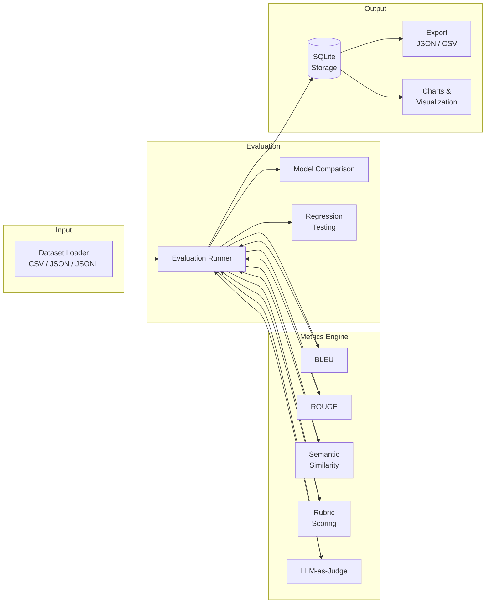

# ML Eval Toolkit


Production-grade ML model evaluation and benchmarking platform. Evaluate LLM and NLP outputs with pluggable metrics, run side-by-side model comparisons, and catch prompt regressions before they ship.

Built for ML teams that need repeatable, automated quality gates in their development workflow — not another notebook-only solution.

## Architecture



## Features

- **Pluggable metrics** — BLEU, ROUGE, semantic similarity, custom rubrics, and LLM-as-judge, all behind a uniform interface
- **Dataset loading** — CSV, JSON, and JSONL with schema validation and train/test/val splits
- **Model comparison** — Run identical evaluations across multiple configs and compare results side-by-side
- **Regression testing** — Set baselines and detect score degradations in CI with configurable thresholds
- **Result storage** — SQLite-backed persistence with aggregation queries and export to JSON/CSV
- **Visualization** — Matplotlib charts for score distributions and comparison bar charts
- **CLI + API** — Click CLI for scripting and CI, FastAPI dashboard for programmatic access
- **Extensible** — Add custom metrics by subclassing `BaseMetric` with a single `compute()` method

## Installation

```bash
git clone https://github.com/gcasti256/ml-eval-toolkit.git
cd ml-eval-toolkit
python3 -m venv .venv
source .venv/bin/activate
pip install -e ".[dev]"
```

## Quick Start

### Programmatic Usage

```python
from ml_eval.datasets.loader import load_dataset
from ml_eval.evaluation.runner import EvalRunner
from ml_eval.config import EvalConfig, MetricConfig
from ml_eval.db import get_connection, init_db

# Connect to results database
conn = get_connection()
init_db(conn)

# Load your evaluation dataset
dataset = load_dataset("examples/sample_data.json")

# Configure metrics
config = EvalConfig(
    dataset_path="examples/sample_data.json",
    metrics=[
        MetricConfig(name="bleu"),
        MetricConfig(name="rouge"),
    ],
    name="quick_eval",
)

# Run evaluation
runner = EvalRunner(conn, config)
result = runner.run(dataset)

# Inspect results
for metric, scores in result.aggregated.items():
    print(f"{metric}: avg={scores['avg']:.4f}, min={scores['min']:.4f}, max={scores['max']:.4f}")
```

### CLI

```bash
# Run evaluation with BLEU and ROUGE metrics
ml-eval run --dataset examples/sample_data.json --metrics bleu,rouge --name my_eval

# Save results as a baseline for regression testing
ml-eval run --dataset examples/sample_data.json --metrics bleu,rouge --save-baseline v1

# Check for regressions against a baseline
ml-eval regression --dataset examples/sample_data.json --metrics bleu,rouge --baseline v1

# Compare multiple configs
ml-eval compare --dataset examples/sample_data.json -c config_a.yaml -c config_b.yaml

# List stored results
ml-eval results --format table
```

## Metrics Reference

| Metric | Key | What It Measures | Requires |
|--------|-----|-----------------|----------|
| BLEU | `bleu` | N-gram precision with brevity penalty (Papineni et al., 2002) | Nothing |
| ROUGE | `rouge` | N-gram recall (ROUGE-1, ROUGE-2) and LCS (ROUGE-L) | Nothing |
| Semantic Similarity | `semantic` | Cosine similarity of sentence embeddings | `sentence-transformers` model |
| Rubric | `rubric` | Custom criteria: keyword presence, length, regex patterns | Criteria config |
| LLM-as-Judge | `llm_judge` | LLM evaluates accuracy, completeness, and clarity (1-10) | `OPENAI_API_KEY` |

### Custom Metrics

Extend the toolkit with your own metrics:

```python
from ml_eval.metrics.base import BaseMetric, MetricResult

class MyMetric(BaseMetric):
    @property
    def name(self) -> str:
        return "my_metric"

    def compute(self, reference: str, hypothesis: str) -> MetricResult:
        score = ...  # your scoring logic, normalized to [0, 1]
        return MetricResult(score=score, details={"custom_field": "value"})
```

## CLI Commands

| Command | Description |
|---------|-------------|
| `ml-eval run` | Run evaluation metrics against a dataset |
| `ml-eval compare` | Side-by-side comparison of multiple configs |
| `ml-eval regression` | Regression test against a stored baseline |
| `ml-eval results` | List stored evaluation runs |

## API Endpoints

Start the API server:

```bash
uvicorn ml_eval.api.app:app --reload
```

| Method | Endpoint | Description |
|--------|----------|-------------|
| `GET` | `/api/v1/health` | Health check |
| `POST` | `/api/v1/evaluate` | Run an evaluation |
| `GET` | `/api/v1/results` | List all evaluation runs |
| `GET` | `/api/v1/results/{run_id}` | Get detailed results for a run |
| `POST` | `/api/v1/compare` | Compare multiple evaluation configs |

Interactive API docs available at `/docs` (Swagger UI) and `/redoc`.

## Project Structure

```
ml-eval-toolkit/
├── src/ml_eval/
│   ├── metrics/          # Pluggable metric implementations
│   │   ├── base.py       # BaseMetric ABC + MetricResult
│   │   ├── bleu.py       # BLEU score (from scratch)
│   │   ├── rouge.py      # ROUGE-1/2/L (from scratch)
│   │   ├── semantic.py   # Sentence-transformer cosine similarity
│   │   ├── rubric.py     # Custom rubric-based scoring
│   │   └── llm_judge.py  # LLM-as-judge via OpenAI
│   ├── datasets/         # Dataset loading + validation
│   │   ├── loader.py     # CSV/JSON/JSONL loading
│   │   ├── schema.py     # Pydantic models for samples
│   │   └── splitter.py   # Train/test/val splitting
│   ├── evaluation/       # Evaluation orchestration
│   │   ├── runner.py     # Core eval runner
│   │   ├── comparison.py # Side-by-side model comparison
│   │   └── regression.py # Baseline regression testing
│   ├── reporting/        # Output + visualization
│   │   ├── exporter.py   # JSON/CSV export
│   │   └── visualizer.py # Matplotlib charts
│   ├── api/              # FastAPI dashboard
│   │   ├── app.py        # App factory
│   │   ├── routes.py     # API route handlers
│   │   └── schemas.py    # Request/response models
│   ├── cli.py            # Click CLI
│   ├── config.py         # Configuration management
│   └── db.py             # SQLite storage layer
├── tests/                # Comprehensive test suite
├── examples/             # Runnable example scripts
├── .github/workflows/    # CI/CD
└── pyproject.toml        # Project config + dependencies
```

## Tech Stack

- **Python 3.11+** with strict type annotations
- **Pydantic v2** for data validation and API schemas
- **FastAPI** for the REST API layer
- **Click + Rich** for the CLI
- **SQLite** for lightweight, zero-config result storage
- **sentence-transformers** for semantic similarity embeddings
- **Matplotlib** for visualization
- **Ruff** for linting, **pytest** for testing

## Contributing

1. Fork the repository
2. Create a feature branch: `git checkout -b feature/my-feature`
3. Install dev dependencies: `pip install -e ".[dev]"`
4. Make your changes and add tests
5. Run the test suite: `pytest --tb=short -q`
6. Lint your code: `ruff check src/ tests/`
7. Submit a pull request

## License

MIT License. See [LICENSE](LICENSE) for details.
